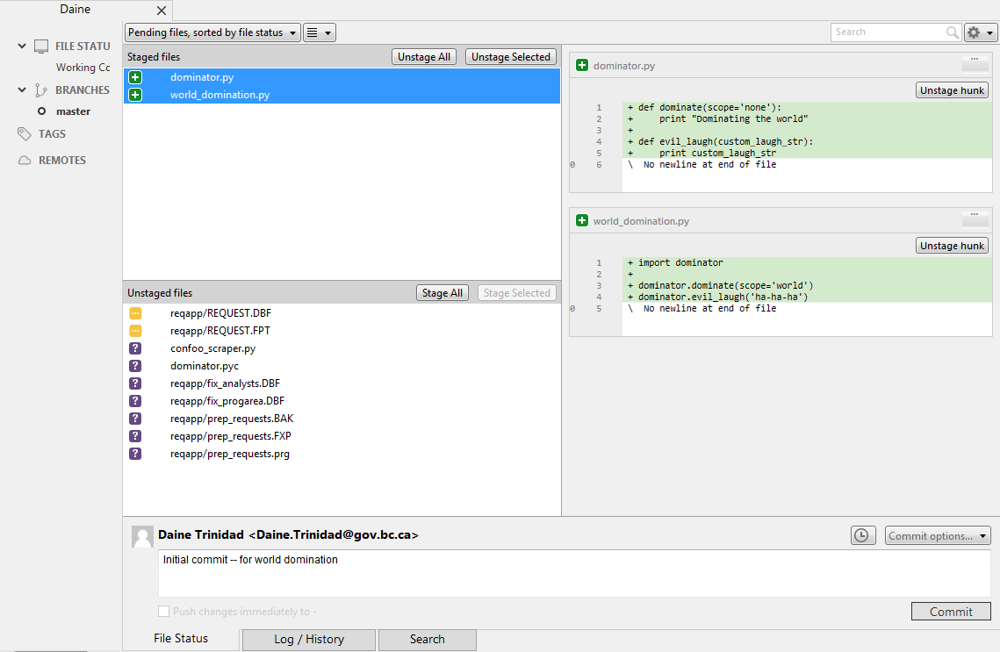
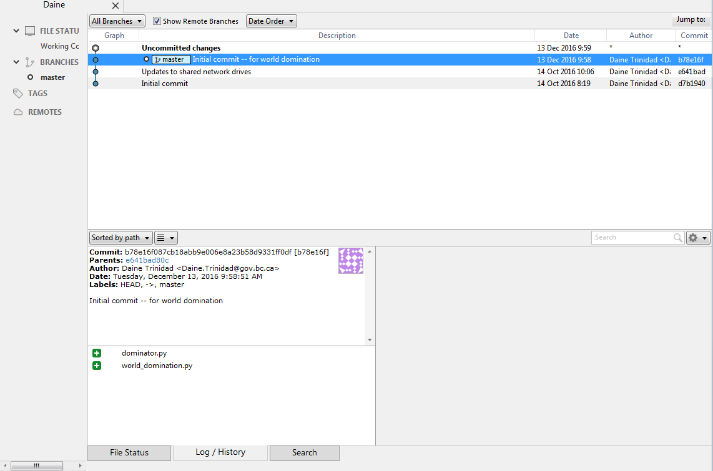

# git

<br />

### managing code we've already written

<br />

(how to make sure we don't lose them)

NOTES:
TADA! No notes, really

=====
## Your Daily Tasks
* **Create** things
* **Save** things
* **Edit** things
* Save the thing **again**


=====
### Many Developers <=> One Code
NOTES:
- Common problem when working on a project
- 2 or more people working on the same file


/////
world_domination.py
```
import dominator

dominator.dominate(scope='world')
dominator.evil_laugh('ha-ha-ha')
```

/////
<div class="fragment"> world_domination.py.old </div>
<div class="fragment"> world_domination.py.older </div>
<div class="fragment"> world_domination.py.oldest </div>
<div class="fragment"> world_domination.py.december_25_1993</div>

<br />
<div class="fragment">daines_world_domination.py</div>
<div class="fragment">connies_world_domination.py</div>

=====
### Enter VCS (Version Control Systems)!


<div class="fragment strike" data-transition="fade-in slide-out" data-fragment-index="0">CVS (Concurrent Version System)</div>
<div class="fragment strike" data-fragment-index="1">SVN (Subversion)</div>
<div class="fragment grow" data-fragment-index="2">GIT ( *just* git)</div>

NOTES:
Centralized Version Control Systems

=====
## What is git?
***Distributed*** version control system

=====
## History
Created by Linus Torvalds for the linux kernel around 2005
<br />
<br />
Replaces the proprietary DVCS used for maintaining the linux kernel

NOTES:
BitKeeper is a proprietary Distributed VCS, which the linux development community was able to use for free.

=====
## What's special about git?
<div class="fragment">Limited downtime</div>
<div class="fragment">Everyone has the complete history</div>
<div class="fragment">Everything is done offline</div>
<div class="fragment">No central authority</div>
<div class="fragment">Changes can be shared without a server</div>

=====
Used at companies such as:

* Google
* Netflix
* Facebook
* Microsoft
* IBM

=====
### What is a repository?

NOTES:
Repository is where all the code is saved, code history
NOT the current running code, but just a directory where people copy the code from

=====
Centralized VCS


/////
Distributed VCS
<br />


=====
# Git basics
[Getting started](https://git-scm.com/book/en/v2/Getting-Started-Git-Basics)

/////
##Snapshots


/////
##Snapshots


/////
## Nearly every operation is local

NOTES:
- No latency overhead
- Uses your PC's computing power to calculate and show the difference in snapshots from months or years ago

/////
## Git has integrity
SHA-1 hashing
NOTES:
Everything is check-summed (hashed) before it is stored
It is impossible to change anything without git knowing about it

/////
## Git only adds data*
\*you can lose data, but only if you *really* mess things up

/////
## Git has three states
* Working directory (Local)
* Staging
* .git repository (Pushed)

=====
## How do I start using git?
(https://git-scm.com/)
Initialize git on your current project
```
git init
```
/////
NOTE: It is important to initialize git on the highest folder in your directory structure
```
+--dwglib
|  +--daine_utils
|  +--common_utils
+--another_lib
```
Please init git on **dwglib** instead of daine_utils or common_utils

```
+--dwglib
|  +--.git/
|  +--daine_utils
|  +--common_utils
+--another_lib
```
<!-- .element class="fragment" -->

=====
# Three Stages

<!-- .element class="fragment" -->

/////
## Lifecycle of your file
(recording changes)

<!-- .element class="fragment" -->

NOTES:
Git is a way to keep your files organized
/////
## Checking on your files
```
git status
```

/////
## Tracking new files
```
git add
```

/////
## Ignoring files
```
.gitignore
```

/////
## Viewing your staged and unstaged changes

/////
## Committing your changes
```
git commit
```

/////
## Skipping the staging area
not recommended

/////
## Moving & renaming files
```
# Rename myoldfile.py to mynewfile.py
git rm myoldfile.py
git add mynewfile.py
```
<br />
```
git mv myoldfile.py mynewfile.py
```
<!-- .element class="fragment" -->

=====
# Commit History
```
git log
```


=====
# Source Tree

/////

/////

/////

/////

/////

/////

/////

/////


